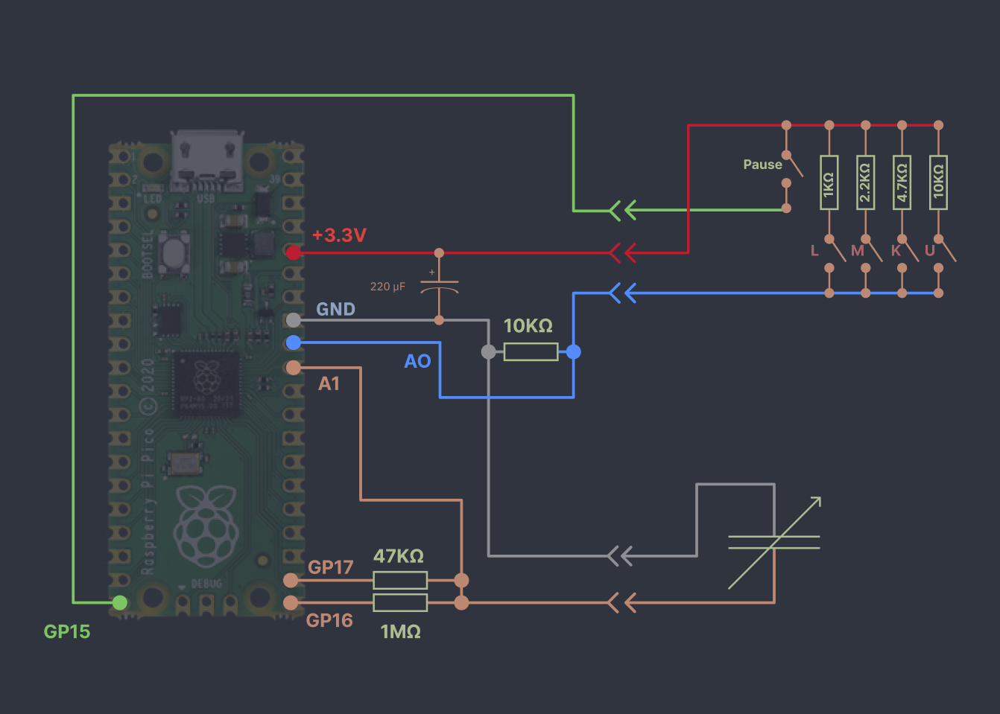
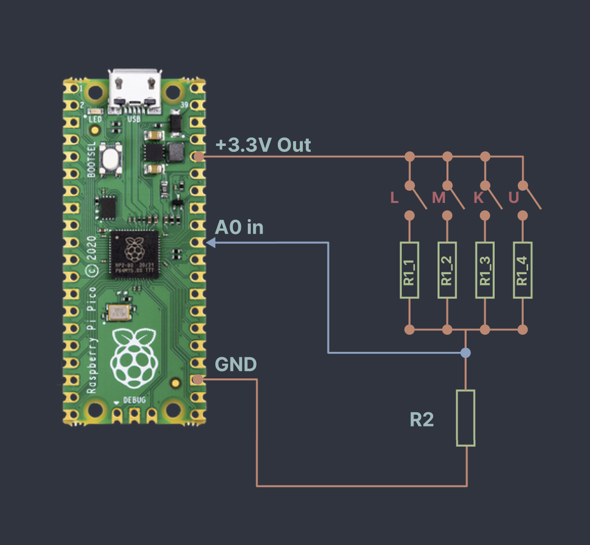
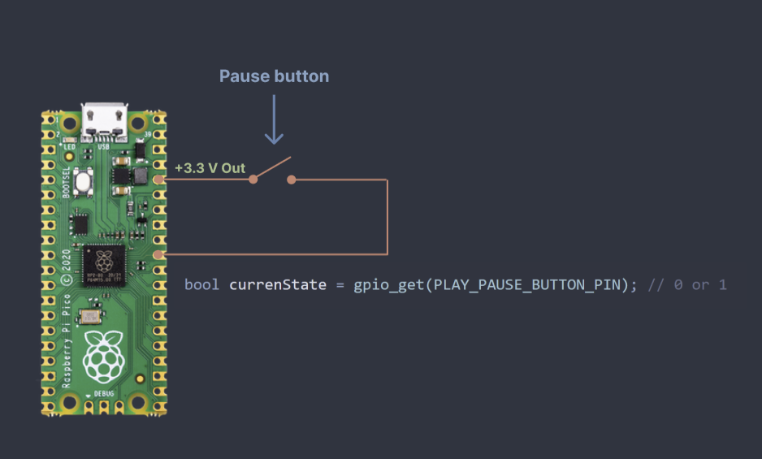
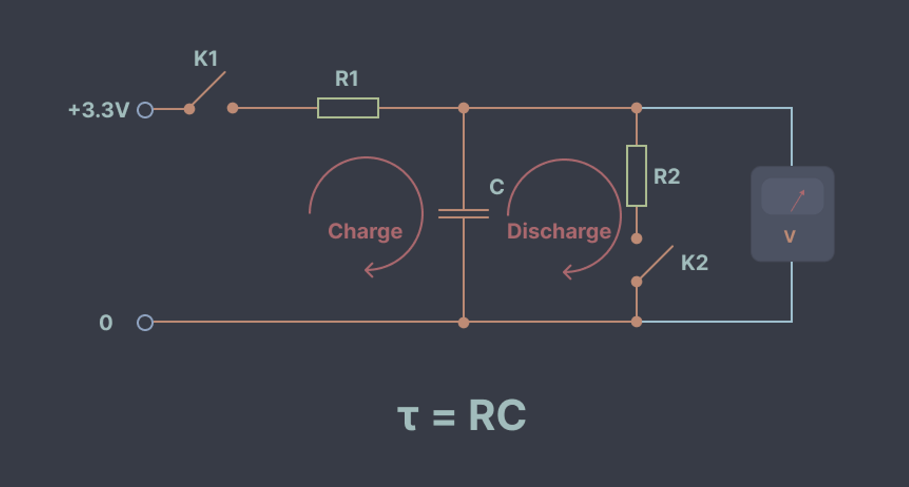
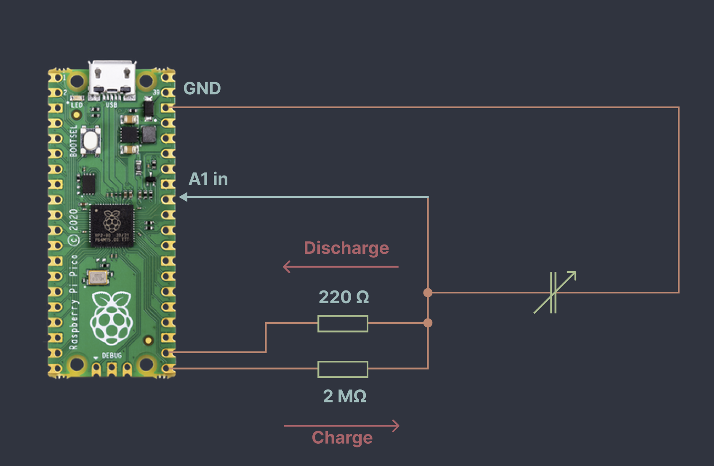

# Pico I/O & RC Tuning Circuit

## Overview

This diagram shows the complete wiring of the control interface built around the Raspberry Pi Pico. The goal of this setup is to read all user inputs from the original radio buttons and tuning knob using a minimal number of GPIO pins, and forward this state to the main controller (Raspberry Pi).

The [firmware](../RadioIO/), written in C++, runs in a loop and performs four main tasks on each cycle:

1. Reads the **digital input** from the play/pause button (`GP15`)
2. Reads the **analog input A0** to determine which band-selection button is pressed via a resistor ladder
3. Measures the **capacitance** on `A1`, which represents the position of the tuning knob
4. Sends the current state as a **JSON message over UART** to the Raspberry Pi, but only if something has changed

---

## Reading band-selection button with a Resistor Ladder (Voltage Divider)

The radio provides four band-selection buttons arranged in a mutually exclusive configuration—only one can be active at any time. This property allows the use of a resistor ladder to multiplex all buttons onto a single ADC input.

### Principle of Operation

The circuit is based on a **voltage divider**. Each button connects a different resistor into the circuit, forming a unique voltage level at the `A0` pin when pressed.

* The top rail is connected to **3.3V**
* Each button (L, M, K, U) selects a different resistor (`R1_1` … `R1_4`)
* All resistors converge to a common node connected to `A0`
* A pull-down resistor (`R2`) connects this node to **GND**

When a button is pressed, it creates a voltage divider between:

* the selected resistor (`R1_x`) to 3.3V
* and `R2` to GND

The resulting voltage at `A0` is:

>Vout = 3.3V * R2 / (R1_x + R2)

Since each button uses a different resistor value, each press produces a distinct voltage level. The Pico’s ADC reads this voltage, and the firmware maps it to the corresponding button.

---

## Play/Pause Button (Digital Input)

In addition to the resistor ladder, the radio has a separate button used for play/pause control. Unlike the band-selection buttons, this button has only two states—pressed and released—so it is read using a simple digital input.

The button is connected to `GP15` and tied to **3.3V** when pressed. The firmware reads its state directly using a GPIO input.

---

## Measuring Capacitance Using RC Timing

To measure capacitance, the system uses a classic **RC (resistor-capacitor) timing method**. The idea is simple: a capacitor charges and discharges exponentially, and the time constant of this process depends on its capacitance.

>tau = R * C

By measuring how fast the capacitor charges, we can calculate its capacitance.

---

### Charging Phase (Measurement)

In the charging phase:

* `GP17` is configured as **output** and driven HIGH (3.3V)
* The capacitor charges through a **high-value resistor (2 MΩ)**
* Voltage on the capacitor is monitored via the ADC (`A1`)
* `GP16` is set to **input mode with no pull resistors**, effectively disconnecting the discharge path (47 kΩ)

This creates a clean RC circuit consisting only of:

* the known resistor (2 MΩ)
* the unknown capacitor

The voltage across the capacitor follows:

>V(t) = Vcc * (1 - exp(-t / (R * C)))

The firmware measures the time it takes for the voltage to reach a predefined threshold (e.g., a fraction of 3.3V). From this time, the capacitance is calculated.

---

### Discharge Phase (Reset)

After the measurement:

* `GP16` is switched to **input mode with no pull resistors**, disconnecting the charging path (2 MΩ)
* `GP17` is switched to **input mode with pull-down enabled**

This connects the capacitor to ground through the **47 kΩ resistor**, allowing it to discharge safely and quickly.

The discharge follows:

>V(t) = V0 * exp(-t / (R * C))

Once the voltage drops sufficiently close to 0V, the system is ready for the next measurement cycle.

