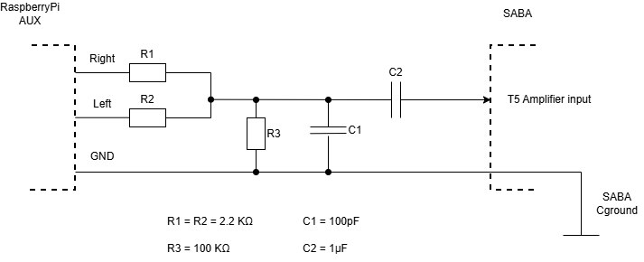

# TFT Display And PICO Wiring

## Raspberry Pi 3.5 mm audio output

## TFT

| Display Pin | Function        | Raspberry Pi Pin |
|------------|---------------|-----------------|
| LEDA       | Backlight      | 3.3V |
| GND        | Ground         | GND |
| VSS        | Power Supply   | 5V |
| CS         | SPI Chip Select    | GPIO 8 (CE0) |
| SDA        | SPI MOSI           | GPIO 10 (MOSI) |
| SCK        | SPI Clock          | GPIO 11 (SCLK) |
| **RS (D/CX)**  | Data/Command  | GPIO 23 |
| **RES**     | Reset         | GPIO 24 |

---

## UART 

| Function  | Raspberry Pi 4 (UART) | Raspberry Pi Pico |
|-----------|----------------|-----------------|
| TX  | GPIO15 (RX)        | GP4 (TX)    |
| RX  | GPIO14 (TX)        | GP5 (RX)    |
| Interrupt | GPIO 26        | GP14 (OUT)       |
| Get Buttons Status interrupt | GPIO 16 | GP22 |
| Play/pause button | -        | GP15 (IN)       |

---

## Buttons (resistors ladder)

Built as voltage divider:

`+3.3V` --- `Button` --- `Resistor` --- `AO input` --- `10KΩ Resistor` --- `GND`

| Button  |  Resistance Ω |
|-----------|-----------------|
| Phono | 220 |
| L | 1K |
| M | 2.2K |
| K | 4.7K |
| U | 10K |

---

## Capacitance

| Function  |  Raspberry Pi Pico |
|-----------|-----------------|
| R1 (charge - `1MΩ`)  |  GP16    |
| R2 (discarge - `220Ω`) | GP17    |
| Voltmeter |  A1       |
| GND |  ADC GND       |
