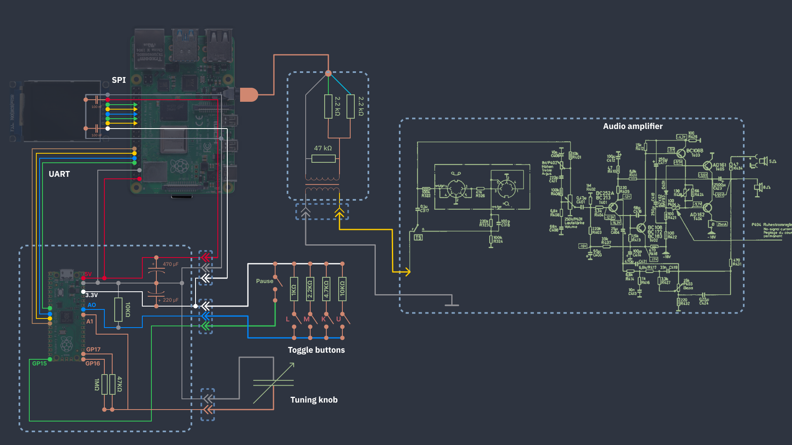

# TFT Display And PICO Wiring

## Final schema

## TFT

| Display Pin | Function        | Raspberry Pi Pin |
|------------|---------------|-----------------|
| LEDA       | Backlight      | 3.3V |
| GND        | Ground         | GND |
| VSS        | Power Supply   | 5V |
| CS         | SPI Chip Select    | GPIO 8 (CE0) |
| SDA        | SPI MOSI           | GPIO 10 (MOSI) |
| SCK        | SPI Clock          | GPIO 11 (SCLK) |
| **RS (D/CX)**  | Data/Command  | GPIO 23 |
| **RES**     | Reset         | GPIO 24 |

---

## UART 

| Function  | Raspberry Pi 4 (UART) | Raspberry Pi Pico |
|-----------|----------------|-----------------|
| TX  | GPIO15 (RX)        | GP4 (TX)    |
| RX  | GPIO14 (TX)        | GP5 (RX)    |
| Interrupt | GPIO 26        | GP14 (OUT)       |
| Get Buttons Status interrupt | GPIO 16 | GP22 |
| Play/pause button | -        | GP15 (IN)       |

---

## Buttons (resistors ladder)

Built as voltage divider:

`+3.3V` --- `Button` --- `Resistor` --- `AO input` --- `10KΩ Resistor` --- `GND`

| Button  |  Resistance Ω |
|-----------|-----------------|
| Phono | 220 |
| L | 1K |
| M | 2.2K |
| K | 4.7K |
| U | 10K |

---

## Capacitance

| Function  |  Raspberry Pi Pico |
|-----------|-----------------|
| R1 (charge - `1MΩ`)  |  GP16    |
| R2 (discarge - `220Ω`) | GP17    |
| Voltmeter |  A1       |
| GND |  ADC GND       |

---

# ESP32 Wiring (v2)

Everything above describes the **Raspberry Pi 4 build**. The sections below replace the Pi with an
**ESP32 (AZ-Delivery DevKit C V4, ESP32-WROOM-32)** and add an **I2S audio board**. The Pico I/O board,
the button ladder, the capacitance tuner and the ST7735 itself are unchanged — only the far end of the
TFT and UART wiring moves.

> **Status.** The three I2S pins are **built and verified** (M1) — music plays out of the PCM5102A
> below into headphones. The TFT and UART blocks are still proposed and get wired at M4/M5; the
> as-built map is confirmed at M6. Mirrors `Architecture.md` §3.1 and
> `Esp32InternetRadio/include/Pins.h` — correct all three together if reality differs.

Strapping pins (0, 2, 12, 15) and flash pins (6–11) are avoided. GPIO 16/17 are deliberately left free
so a WROVER swap stays a `platformio.ini` change.

## I2S audio — PCM5102A (verified working, M1)

| PCM5102A Pin | Function | ESP32 Pin |
|---|---|---|
| VIN | Power Supply | VIN (5V) |
| GND | Ground | GND |
| BCK | I2S Bit Clock | GPIO 26 |
| LCK | I2S Word Select (LRCK) | GPIO 25 |
| DIN | I2S Data | GPIO 22 |
| **SCK** | System Clock | **GND** — tie low to use the internal PLL |

Mode straps on the PCM5102A board:

| Strap | Set to | Meaning |
|---|---|---|
| FMT | GND (L) | I2S format |
| FLT | GND (L) | Normal filter |
| DEMP | GND (L) | De-emphasis off |
| **XSMT** | **3.3V (H)** | **Un-mute.** Low = soft mute: silence with a healthy serial log |

On the common purple GY-PCM5102A boards these four straps are solder jumpers on the back (`H1L`→FLT,
`H2L`→DEMP, `H3L`→XSMT, `H4L`→FMT) and the factory setting varies between batches — measure, do not
assume. On the module used at M1 all four were already correct. If `XSMT` does read 0 V, cut its bridge
to `L` before strapping it high: the pad is a hard short to ground, so wiring it to 3.3 V would short
the regulator.

> ⚠️ **The first module tried at M1 was simply dead** — every input in the tables above measured
> correct, and it still produced ~5 mV at `LOUT`/`ROUT`. A second board of the same type, on the same
> wiring and the same firmware, played straight away. Keep a spare, and when a board is silent use
> `pio run -e tone-test` (440 Hz sine, no WiFi, no audio library) to judge the board on its own before
> suspecting anything else. Full elimination trail in `DeliveryPlan.md` M1.

The mono mix already exists in the cabinet, so there is nothing to build: a 3.5 mm male-to-male cable
from this board's own jack goes to the same summing network the Pi fed — two 2.2 kΩ resistors into a
47 kΩ shunt and an audio transformer whose secondary drives the SABA amplifier. The PCM5102A's
2.1 Vrms full scale is about 5× the Pi's ~0.4 Vrms, so the fixed software gain has to come down roughly
14 dB to match (`kFixedGain` ≈ 9). See also [`SabaCircuit.md`](SabaCircuit.md).

## TFT

Same ST7735 panel, rewired from the Pi's SPI header to the ESP32's VSPI.

| Display Pin | Function | ESP32 Pin |
|---|---|---|
| LEDA | Backlight | 3.3V |
| GND | Ground | GND |
| VSS | Power Supply | 5V |
| CS | SPI Chip Select | GPIO 5 |
| SDA | SPI MOSI | GPIO 23 (VSPI) |
| SCK | SPI Clock | GPIO 18 (VSPI) |
| **RS (D/CX)** | Data/Command | GPIO 21 |
| **RES** | Reset | GPIO 4 |

## UART

Same Pico, same firmware, same pins on the Pico side.

| Function | ESP32 (UART2) | Raspberry Pi Pico |
|---|---|---|
| RX | GPIO 27 | GP4 (TX) |
| TX | GPIO 14 | GP5 (RX) — wired but unused |
| Interrupt | GPIO 34 (input-only) | GP14 (OUT) |
| Get Buttons Status interrupt | GPIO 33 | GP22 |
| Play/pause button | - | GP15 (IN) |

The link is one-way in practice: `RadioIO` only ever writes and nothing on the Pico reads its RX line,
which is why GPIO 14 (which emits boot noise) is harmless here. GPIO 34 is input-only and needs no pull
configuration.
