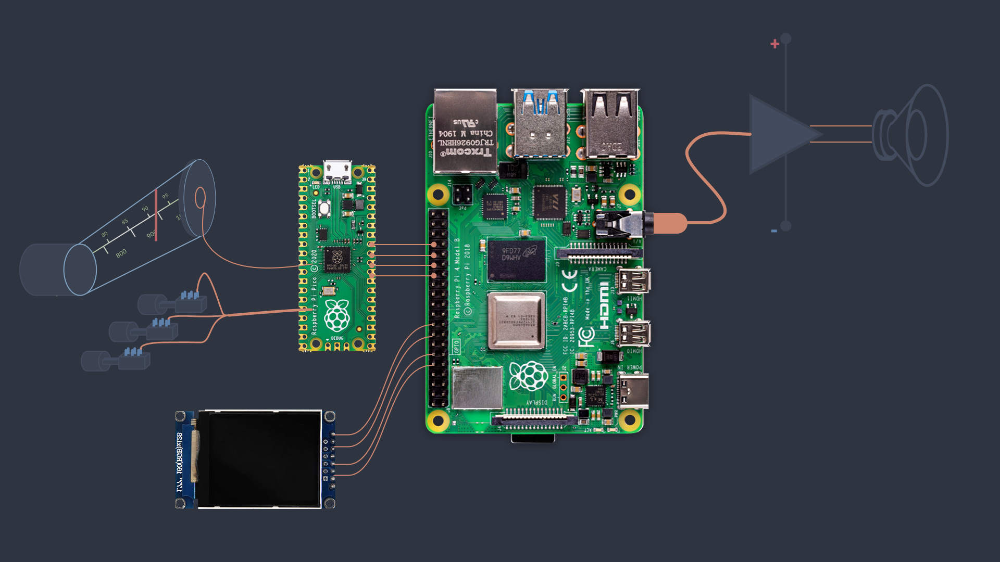

# Analog transistor radio upgrade project

This project transforms a vintage German transistor radio — the **SABA Mainau** — into a modern smart audio device powered by **Raspberry Pi 4** and **Raspberry Pi Pico**. While preserving the iconic design and analog audio amplifier of the original, the project adds support for **Spotify Connect**, **Internet Radio**, and a **TFT display interface**, fully controlled by physical buttons and a rotary tuning dial.

---

## 📦 Hardware Overview

- [**Raspberry Pi 4**](https://www.raspberrypi.com/products/raspberry-pi-4-model-b/) — main processing unit (audio, web interface, display)
- [**Raspberry Pi Pico**](https://www.raspberrypi.com/products/raspberry-pi-pico/) — microcontroller for reading physical I/O (buttons, tuning dial)
- [**1.77" TFT SPI Display** (128x160, ST7735)](https://www.az-delivery.de/en/products/1-77-zoll-spi-tft-display)
- **Original SABA transistor amplifier** — reused as final stage for audio output

---

## 🔧 Hardware Integration Plan

- Remove original radio circuits, leaving only the **transistor audio amplifier**.
- **Mix stereo output** from Raspberry Pi’s 3.5mm jack into mono using two resistors. And inject this signal into radio's circuit.
- Mount **TFT display** to the front panel, connected to **SPI interface** of the Pi 4.
- Connect physical **buttons** to **Raspberry Pi Pico**.
- Use the original **variable capacitor** (from radio oscillator) as a **tuning dial**:
  - Read its analog value via **RC circuit** and ADC input on the Pico.
- Connect **Pico and Pi 4 via UART**: Pico acts as an **I/O controller**, sending input events to the Pi.

---

## 🎯 Functional Features

The device will support **two modes**, switchable via physical controls:

1. **Spotify Connect Mode**
   - Acts as a Spotify Connect device via **Raspotify**.
   - Use physical button for **Play/Pause**.
   - Use tuning dial to skip to **Next/Previous Track**.
   - TFT screen shows **track info and album art** via **Spotify API**.

2. **Internet Radio Mode**
   - Streams MP3 radio stations via **VLC**.
   - Use physical controls to **Play/Pause** and **switch stations**.
   - TFT screen displays station name and status.

---

## 🧠 Software Architecture

- **OS**: Raspberry Pi OS Lite
- **Audio**:
  - Spotify: `Raspotify` (daemon)
  - Radio: `libVLC` (called via .NET)
- **Main Application**: `.NET 9 WebAPI` hosted on Raspberry Pi 4
  - **BackgroundWorker** for input handling and mode management
  - **SQLite** database to store:
    - Radio stream URLs
    - Spotify authorization tokens
- **GPIO/SPI/UART**: Accessed via `PIGPIO` C library + .NET interop (P/Invoke)
- **Frontend UI**:
  - Web interface built with **Angular**
  - Used for **initial setup** and **Spotify authentication**
  - Hosted together with WebAPI app, accessible in local network via [NGINX](https://nginx.org/index.html)

---

## 🔗 Communication Between Components

| Component        | Interface | Role                             |
|------------------|-----------|----------------------------------|
| Raspberry Pi 4   | UART      | Master, receives input events    |
| Raspberry Pi Pico| UART + ADC| I/O controller (buttons, dial)   |
| Pi 4 ↔ TFT LCD   | SPI       | Display track/station info       |

---

## 🧾 Documentation

All schematics, wiring diagrams, and specifications are in the [`Docs/`](Docs) folder:

- [Raspberry Pi Setup instructions](Docs/Deployment.md)
- [System Architecture](Docs/SystemOverview.md)
- [TFT Display And PICO Wiring](Docs/Wiring.md)
- [Pico I/O & RC Tuning Circuit](Docs/PicoControl.md)
- [SABA Upgrade Circuit Plan](Docs/SabaCircuit.md)

Diagrams are stored in [`Docs/Img/`](Docs/Img) and created using [draw.io](https://draw.io).

---

## 🗂 Repository Structure

| Folder | Description |
|--------|-------------|
| RadioApp | .NET WebAPI and main worker service project |
| RadioFrontend | Angular "admin" application for Spotify authentication and setup radio channels |
| RadioIO | C firmware for Raspberry Pi Pico |
| Docs | Markdown documentation & diagrams |
